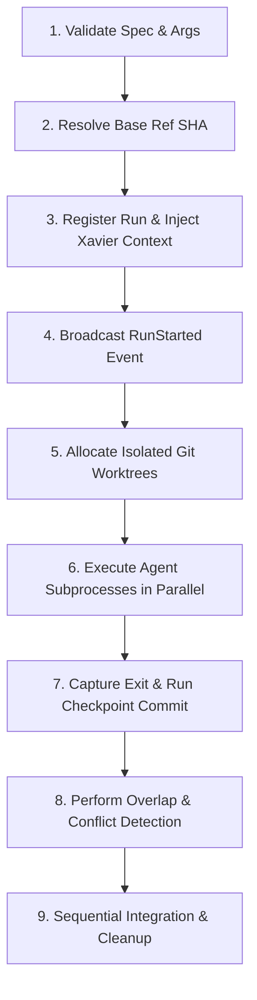

# Multi-Agent Orchestration & Gestalt Run Guide

This guide details how to use, configure, and troubleshoot the `gestalt run` command in the **Gestalt** multi-agent orchestration framework.

---

## 1. Functional Tutorial

The `gestalt run` command coordinates multiple code agents working simultaneously on a single codebase. It automatically isolates their environments using Git worktrees, tracks their progress, detects overlapping edits, and merges non-conflicting changes.

### Quick Example

To run a multi-agent orchestration run, specify the overall objective with `--task` and define individual agents using one or more `--agents` command strings.

```bash
gestalt run \
  --task "Refactor authentication modules and update configuration templates" \
  --agents "python agents/auth_agent.py" \
  --agents "python agents/config_agent.py" \
  --base-ref main \
  --max-parallel 2 \
  --timeout 120
```

### Realistic Walkthrough: Running with Mock Agents

For demonstration and local testing, you can execute a run using standard CLI utility commands as mock agents:

```bash
# 1. Start the run with two agents modifying different files
cargo run -p gestalt_cli -- run \
  --task "Create README and update license documentation" \
  --agents "touch README.md" \
  --agents "touch LICENSE-MIT" \
  --base-ref main
```

#### What Happens Under the Hood:
1. **Isolation**: Gestalt spawns two separate, isolated Git worktrees.
2. **Execution**: One worktree runs `touch README.md`, the other runs `touch LICENSE-MIT` in parallel.
3. **Commit**: Gestalt automatically commits the respective changes under separate git branches.
4. **Integration**: Since there are no overlapping file modifications, the branches are successfully integrated back into the target branch without any merge conflicts.

---

## 2. CLI Reference

### Command Syntax

```bash
gestalt run [OPTIONS] --task <TASK>
```

### Options & Flags

| Option / Flag | Description | Default Value | Required |
|:---|:---|:---|:---:|
| `--task <TASK>` | The primary goal/description for the multi-agent orchestration run. | *None* | **Yes** |
| `--agents <COMMAND>` | The CLI command string to invoke an agent. Can be specified multiple times to run multiple agents in parallel. | *None* | **Yes** |
| `--base-ref <REF>` | The base git branch or commit SHA to branch the agent worktrees from. | `main` | No |
| `--max-parallel <NUM>` | Maximum number of agents allowed to execute concurrently. | `4` | No |
| `--timeout <SECONDS>` | Maximum runtime (in seconds) allowed for each individual agent. | `300` | No |
| `--url <URL>` | Overrides the MCP server URL defined in the configuration. | Config defined | No |
| `-v, --verbose` | Enables verbose/debug-level logging. | `false` | No |
| `-h, --help` | Prints help documentation for the command. | *None* | No |

### Environment Variables

* **`GESTALT_HOME`**: Customizes the home directory where logs, run metadata, and temporary worktrees are stored (defaults to `~/.gestalt` if not set).
* **`GESTALT_DATABASE_URL`**: Database connection string for storing run history and agent states (e.g. `file:/tmp/gestalt.db`).
* **`XAVIER_URL`**: Base URL of the Xavier context/memory server (defaults to `http://127.0.0.1:8006`).
* **`XAVIER_CONTEXT`**: Automatically injected by the router into each agent's execution environment, containing up to 5 prior related context objects fetched from Xavier.

### Exit Codes

| Exit Code | Meaning | Description |
|:---:|:---|:---|
| **`0`** | **Success** | The run completed successfully, and all agents completed and merged without conflicts. |
| **`1`** | **Failure / Conflict** | The router execution failed, an agent panicked, or unresolved merge conflicts occurred during integration. |
| **`130`** | **SIGINT** | The run was aborted manually by the user (Ctrl+C). |
| **`137`** | **SIGKILL / Timeout** | An agent process exceeded its timeout limits and was forcefully killed. |

---

## 3. Architecture Overview (The 9-Step Pipeline)

Gestalt implements a resilient multi-agent execution pipeline. Below is the detailed breakdown of how a run executes from start to finish.



### Pipeline Details

1. **Step 1: Validation & Initialization**
   The router parses the `RunSpec`, checking that at least one agent is specified and that all option constraints (e.g. timeout limits) are valid.
2. **Step 2: Base SHA Resolution**
   The specified `--base-ref` (e.g., `"main"`) is resolved to a static, concrete Git commit SHA exactly once at the beginning of the run to prevent race conditions from concurrent commits.
3. **Step 3: Run Registration & Context Retrieval**
   The run metadata is registered in the persistent `StateDb`. Simultaneously, Gestalt queries the Xavier memory server for any prior, relevant context matching the task goal and injects it into each agent's execution environment as the `XAVIER_CONTEXT` variable.
4. **Step 4: Event Notification**
   The router writes a `RunStarted` event to the append-only JSONL timeline and broadcasts the run details over WebSockets to any connected clients.
5. **Step 5: Isolated Worktree Allocation**
   Using its internal `WorktreeManager`, Gestalt spawns dedicated Git worktrees under the run directory (`~/.gestalt/runs/{run_id}/wts/{agent_id}`). This isolates each agent on a separate POSIX-native directory.
6. **Step 6: Parallel Agent Subprocess Execution**
   The `SubprocessRunner` spawns each agent's command with its CWD directed to its respective isolated worktree. Process isolation is enforced via Unix process groups (`setsid`).
7. **Step 7: Checkpoint Commit**
   Once an agent process completes, the router executes `checkpoint()`. It runs `git add` and commits any modified or untracked files with `--no-verify` to bypass user-defined pre-commit hooks.
8. **Step 8: Overlap Detection**
   Before merging, the router compares the file diff of all completed agent branches. If two or more agents modified the same physical file paths, Gestalt logs an `OverlapDetected` event.
9. **Step 9: Sequential Integration & Cleanup**
   In a separate dedicated integration worktree, Gestalt sequentially merges all successful agent branches using low-level `git merge-tree` operations. If a merge conflict occurs, it logs a `MergeConflict` event and leaves the conflict unresolved on that agent's branch. Finally, all temporary worktrees are forcefully purged, the final `RunReport` is saved, and the run results are archived into Xavier.

---

## 4. Troubleshooting Guide

### 1. Agent Process Timeout
* **Symptom:** An agent output ends abruptly, and the final state is logged as `Timeout` (or exit code `137`).
* **Root Cause:** The agent process did not complete its execution within the requested `--timeout` limit.
* **Resolution:** Re-run the orchestration command with an increased timeout value:
  ```bash
  gestalt run --task "Refactor code" --agents "python slow_agent.py" --timeout 600
  ```

### 2. Merge Conflicts
* **Symptom:** The `RunReport` returns `Success: true` but highlights several unresolved conflicts under the `conflicts` property, and changes are missing from the integrated branch.
* **Root Cause:** Multiple agents modified overlapping blocks of the same file, resulting in merge conflicts that `git merge-tree` could not safely auto-resolve.
* **Resolution:**
  1. Inspect the agent branches generated during the run (named `gestalt/{run_id}/{agent_id}`).
  2. Manually merge the conflicting branches using a standard Git workflow:
     ```bash
     git checkout main
     git merge gestalt/{run_id}/agent-0
     # Resolve any conflicts manually, then commit
     ```

### 3. Git Worktree Lock Conflicts
* **Symptom:** The command fails early during step 5 with `GitError: Failed to create worktree...` or a locked repository state.
* **Root Cause:** A previous run crashed abruptly (e.g. power loss, sigkill to the orchestrator), leaving orphaned Git worktrees registered in `.git/worktrees`.
* **Resolution:** Use the built-in `doctor` command to identify and purge orphaned runs and release worktree allocations safely:
  ```bash
  # List all orphaned or left-over runs
  cargo run -p gestalt_cli -- doctor

  # Forcefully prune and clean up all orphaned worktrees and branches
  cargo run -p gestalt_cli -- doctor --prune
  ```
